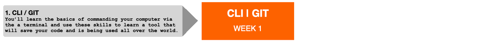
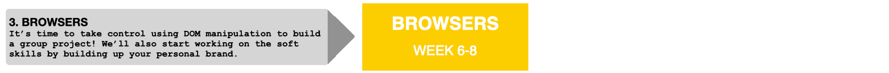
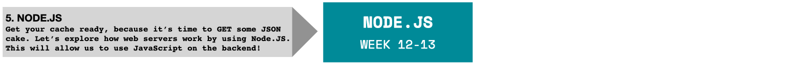
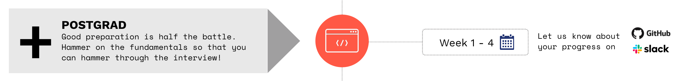
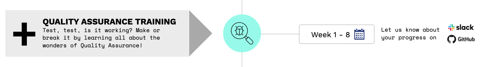

# HackYourFuture Curriculum

> Here you can find an overview of the HackYourFuture program. It gives insight into how our program is structured, organized, what you can expect from the modules that we teach and, last but not least, where we teach and where you can find support during the week. Below you can find an outline of the contents and learning goals per module. The headers of the different modules link to the actual repositories that both trainees and mentors will use to go through the material.

- Are you a new mentor? Take a look [here](https://github.com/HackYourFuture/mentors) for some practical tips on how to get started!
- Are you a new trainee? Be sure to get started with our [Welcome Guide](https://github.com/HackYourFuture/curriculum/blob/master/welcome.md) to see how to prepare for your first session and beyond!

## Before you continue

If you are an aspiring trainee at HackYourFuture, please note that before you can do the application assignment mentioned on the website we expect you to already have done the [Explore module](https://github.com/HackYourFuture/explore). This module you can do on your own in your own time to see if web development and the HackYourFuture program is right for you. We hope it is!

## Overview

The HackYourFuture curriculum consists of 8 modules, spread over 7 months. In the following diagram you'll find the sequence of all the modules included:

## Learning goals

If you follow the program you'll learn the following skills:

- Ability to `build a basic modern full-stack web application` (using NodeJS, MySQL, MongoDB and React)
- Get experience with working in teams using `Agile principles`
- Knowing how to `learn and self-teach new programming concepts`
- How to use `third-party libraries/APIs`
- Have a basic understanding of what it means to work on digital products

## Module #1 - [CLI/GIT](https://github.com/HackYourFuture/CLI-Git)

Welcome to HackYourFuture! In this module we are going to go into two things that are maybe not as fun as building websites like you did in the application process, but are vital to your success as a developer: the command-line interface (CLI) and Git.

The command-line interface is a way for you to give commands to your computer using text rather than clicking, which will be used throughout your developer life. As you may have already guessed, it is much easier for any code you write to talk to the computer via defined commands rather than trying to navigate a user interface meant for humans. In this module we will give you a quick overview how to access the command-line interface and what commands you will use the most.

You'll also be learning Git, which is software that will allow you to save your folders and files in case they accidentally get deleted or end up corrupt. It is the industry standard when talking about version control of your code and we will be using it all the time during the curriculum so that you become familiar with it.

In the following table you can find the module material, week-by-week:

| Week | Topic                                      | Reading Material                                                                   | Assignments                                                                             |
| ---- | ------------------------------------------ | ----------------------------------------------------------------------------------- | ------------------------------------------------------------------------------------ |
| 1.   | Command Line Interface basics, Git, GitHub | [W1 Reading](https://github.com/HackYourFuture/CLI-Git/tree/master/Week1/README.md) | [Assignment W1](https://github.com/HackYourFuture/CLI-Git/tree/master/Week1/MAKEME.md) |

### **Module goals**

By the end of this module, trainees should have a familiarity with and basic understanding of the following:

- Understand what a terminal is
- Know what markdown is and how to create a README
- Navigate the folders of your computer using the `command line interface (CLI)`
- Understand wat Git is used
- Use `GIT` commands and be able to:
  - Create a branch
  - Commit changes
  - Merge branches

## Module #2 - [JavaScript](https://github.com/HackYourFuture/JavaScript/)

In this module you'll make a start into the wonderful world of programming. We will be using the programming language JavaScript to do so. You'll learn about the basic building blocks of programming: `loops`, `functions`, `control flow` and more advanced JavaScript specific intricacies. Consider these as the ABC's of programming, without them it's impossible to write working software!

| Week | Topic                                                      | Reading Material                                                                       | Assignments                                                                                 |
| ---- | ---------------------------------------------------------- | --------------------------------------------------------------------------------------- | ---------------------------------------------------------------------------------------- |
| 1.   | JS Basics Refresher, Loops, Naming Conventions                         | [Reading W1](https://github.com/HackYourFuture/JavaScript/tree/main/Week1/README.md) | [Assignment W1](https://github.com/HackYourFuture/JavaScript/tree/main/Week1/MAKEME.md) |
| 2.   | Scope, ModernJS, Problem Solving                                       | [Reading W2](https://github.com/HackYourFuture/JavaScript/tree/main/Week2/README.md) | [Assignment W2](https://github.com/HackYourFuture/JavaScript/tree/main/Week2/MAKEME.md) |
| 3.   | Higher Order Functions, Closures, Unit Testing                         | [Reading W3](https://github.com/HackYourFuture/JavaScript/tree/main/Week3/README.md) | [Assignment W3](https://github.com/HackYourFuture/JavaScript/tree/main/Week3/MAKEME.md) |
| 4.   | This keyword, constructor functions, classes                           | [Reading W4](https://github.com/HackYourFuture/JavaScript/tree/main/Week4/README.md) | [Assignment W4](https://github.com/HackYourFuture/JavaScript/tree/main/Week4/MAKEME.md) |

### **Module goals**

By the end of this module, trainees should have a familiarity with and basic understanding of the following:

- Have an idea of what `computer programming` is
- Know the basic building blocks of `JavaScript`
- Correctly write and use `variables`, `functions` and `loops`
- Understand the `control flow`
- Think like a programmer
- Know what your `personal brand` is and how to make it professional

## Module #3 - [Browsers](https://github.com/HackYourFuture/Browsers)

In **Browsers** you'll learn all about how to use JavaScript within the browser. First, you'll learn about how HTML is structured within your browser: we call this the `Document Object Model` (DOM). Once you've gotten the hang of that we'll apply JavaScript to it, in order to manipulate the elements and make our pages more interactive. We call this `DOM manipulation` and it's one of the most interesting things about JavaScript! We will finish off with a group project to already combine everything you have learned into your first web application. Besides the technical part, you'll improve your 'soft skills' as well in the [Presentation module](https://github.com/HackYourFuture/presentation-module). This is a two weeks program that will get you out of your comfort zone. Check the Read.me file for a more detailed explanation and overview.

| Week | Topic                                                             | Reading Material                                                                    | Assignments                                                                              |
| ---- | ----------------------------------------------------------------- | ------------------------------------------------------------------------------------ | ------------------------------------------------------------------------------------- |
| 1.   | Document-Object Model (DOM), DOM manipulation                     | [Reading W1](https://github.com/HackYourFuture/Browsers/tree/master/Week1/README.md) | [Assignment W1](https://github.com/HackYourFuture/Browsers/tree/master/Week1/MAKEME.md) |
| 2.   | Presentation Module week 1, Group project week 1!                 | [Reading W2](https://github.com/HackYourFuture/Browsers/tree/master/Week2/README.md) | [Assignment W2](https://github.com/HackYourFuture/Browsers/tree/master/Week2/MAKEME.md) |
| 3.   | Presentation Module week 2, Group project week 2 + Tech interview | [Reading W3](https://github.com/HackYourFuture/Browsers/tree/master/Week3/README.md) | No individual assignment                                                                |

### **Module goals**

In order to successfully complete this module you will need to master the following:

- Understand what the `Document Object Model` (DOM) is
- Use the basics of `DOM Manipulation`
- Gain awareness of the inner workings of JavaScript
- Be able to present your ideas in a professional setting

## Module #4 - [Using API's](https://github.com/HackYourFuture/UsingAPIs)

A big part of being a programmer means moving data from one place to another. It also means working with other people's software. In this module you'll be learning about one of the core things of what makes a web developer: working with APIs! On top of that you'll also learn how to think differently about how you write your programs. Like in any field, once you've mastered a particular way of doing things you start thinking about how it could be done differently. In the end you will also build a full project by yourself that takes data from publicly available API's to create a web application with substance!

| Week | Topic                                                                           | Reading Material                                                                     | Assignments                                                                               |
| ---- | ------------------------------------------------------------------------------- | ------------------------------------------------------------------------------------- | -------------------------------------------------------------------------------------- |
| 1.   | Synchronous vs asynchronous, Callbacks, Promises, The Event Loop                | [Reading W1](https://github.com/HackYourFuture/UsingAPIs/tree/master/Week1/README.md) | [Assignment W1](https://github.com/HackYourFuture/UsingAPIs/tree/master/Week1/MAKEME.md) |
| 2.   | Application Programming Interface (API), Fetch, Async/await, Career Training II | [Reading W2](https://github.com/HackYourFuture/UsingAPIs/tree/master/Week2/README.md) | [Assignment W2](https://github.com/HackYourFuture/UsingAPIs/tree/master/Week2/MAKEME.md) |
| 3.   | Individual project + Tech interview                                             | [Project](https://github.com/HackYourFuture/UsingAPIs/tree/master/Week3/README.md)    |                                                                                        |

### **Module goals**

In order to successfully complete this module you will need to master the following:

- Differentiate between `synchronous` and `asynchronous` operations
- Learn what an `Application Programming Interface` (API) is
- Connect with different `public APIs`
- Build a `Single Page Application` (SPA)
- Work with pre-existing code
- Be able to nail an interview

## Module #5 - [Node.js](https://github.com/HackYourFuture/Node.js)

Any software application consists of at least 2 parts: a frontend, which is what the user sees and interacts with, and a backend. This module will expose you to the wonderful world of backend development, where you learn all about where your data goes once you've pressed that submit button. You'll be writing web servers and learn how to send users the right feedback.

| Week | Topic                               | Reading Material                                                                          | Assignments                                                                             |
| ---: | ----------------------------------- | ------------------------------------------------------------------------------------ | ------------------------------------------------------------------------------------ |
|   1. | Client-server model, HTTP & Express | [Readings W1](https://github.com/HackYourFuture/Node.js/tree/master/week1/README.md) | [Assignment W1](https://github.com/HackYourFuture/Node.js/tree/master/week1/MAKEME.md) |
|   2. | REST, CRUD & API                    | [Readings W2](https://github.com/HackYourFuture/Node.js/tree/master/week2/README.md) | [Assignment W2](https://github.com/HackYourFuture/Node.js/tree/master/week2/MAKEME.md) |
|   3. | TBD                    | [Readings W3](https://github.com/HackYourFuture/Node.js/tree/master/week3/README.md) | |

### **Module goals**

In this module you will get familiar with the world of backend development. By the end of it, you have learned:

- What is meant by the term `backend`
- The `client-server` model
- What `HTTP` and `REST` mean
- How to `create your own web servers` with Node.js, using `Express.js`
- How to use the `Node Package Manager (NPM)`.
- How to use Express.js to make a `RESTful API`
- How to build a small `full-stack application`

## Module #6 - [Databases](https://github.com/HackYourFuture/databases)

In this module you'll learn all about a fundamental part of any software application: how to (safely) store data, so that it can be used on-demand. You'll learn how to structure and group data so your apps know where to find and store the correct data.

| Week | Topics | Reading Material | Assignments |
| ---- | ----------------------------------------------- | -------------------------------- | -------------------------------- |
| 1. | What's a database, Entities, Data structures, Structured Query Language (SQL) | [Readings W1](https://github.com/HackYourFuture/databases/tree/master/Week1/README.md) | [Assignment W1](https://github.com/HackYourFuture/databases/tree/master/Week1/MAKEME.md) |
| 2. | Identifiers, Relationships, Domain Modeling, Advanced SQL commands | [Readings W2](https://github.com/HackYourFuture/databases/tree/master/Week2/README.md) | [Assignment W2](https://github.com/HackYourFuture/databases/tree/master/Week2/MAKEME.md) |
| 3. | Normalization, Transactions, SQL Injection, NoSQL (with MongoDB) | [Readings W3](https://github.com/HackYourFuture/databases/tree/master/Week3/README.md) | [Assignment W3](https://github.com/HackYourFuture/databases/tree/master/Week3/MAKEME.md) |
| 4. | NoSQL advanced commands, Pagination, SQL vs NoSQL | [Readings W4](https://github.com/HackYourFuture/databases/tree/master/Week4/README.md) | [Assignment W4](https://github.com/HackYourFuture/databases/tree/master/Week4/MAKEME.md) |

### **Module goals**

In this module you will get familiar with the complexity of storing data. By the end of it you have learned:

- What the meaning is of a `database entity`
- How to work with `Structured Query Language` (SQL)
- Learn all about the `relational model`
- Recognize the `basic setup of a database`
- Know about `MySQL` as an example of a relational database system
- Learn about NoSQL databases, with an emphasis on `MongoDB`

## Module #7 - [React](https://github.com/HackYourFuture/React)

In these 4 weeks we will go back to the frontend and learn how to make faster, more modern user interfaces. You'll become more familiar with a frontend technology called [React.js](https://reactjs.org/), a JavaScript library written and maintained by Facebook.

It is mainly used to create dynamic user interfaces, changing the data a user sees depending on their input.

In this module you'll learn about how to think about web pages in a radically different way: instead of making separate pages, you'll be making components of pages. Instead of hardcoded content, you'll make structures that can hold different data.

| Week | Topics | Reading Material | Assignments |
| ---- | ----------------------------------------------- | -------------------------------- | -------------------------------- |
| 1. | What is React, JSX, State & Props, Deploy a static site | [Readings W1](https://github.com/HackYourFuture/React/blob/master/week1/README.md) | [Assignment W1](https://github.com/HackYourFuture/React/blob/master/week1/MAKEME.md) |
| 2. | API calls, Context | [Readings W2](https://github.com/HackYourFuture/React/blob/master/week2/README.md) | [Assignment W2](https://github.com/HackYourFuture/React/blob/master/week2/MAKEME.md) |
| 3. | Client-side routing, Custom hooks | [Readings W3](https://github.com/HackYourFuture/React/blob/master/week3/README.md) | [Assignment W3](https://github.com/HackYourFuture/React/blob/master/week3/MAKEME.md) |
| 4. | Project! | [Readings W4](https://github.com/HackYourFuture/React/blob/master/week4/README.md) | |

### **Module goals**

By the end of this module, trainees should have a familiarity with and basic understanding of the following:

- Understand the React way of thinking about `user interfaces`
- Know the importance and place of `state` and how to pass it down
- Be able to work with different `lifecycle hooks`
- Distinguish between `class-based versus function-based components`
- Recognize the utility of `modularization`
- Putting emphasis on writing reusable code (`components`)
- How to handle `client-side routing`

## Module #8 - [Project](https://github.com/HackYourFuture/Project)

In the upcoming 6 weeks you'll be immersed into the web developer life. By the end of it you will have created a full-stack web application and published it to the internet.

Everything you have learned so far will be combined and put into practice. Added to that you'll learn some more cutting-edge technologies that will prepare you for a great start in a modern software company. We will start out with the basics and incrementally add more complexity. This way you'll learn how all the pieces of a RESTful API fit together, thereby gaining a deeper understanding of where the backend stops and the frontend starts.

Along with practicing your programming skills you will also be working on your communication skills. This is just as important, because you need to be able to communicate your ideas and efforts in an easy-to-understand manner.

| Week # | Topic                                  |
| ------ | -------------------------------------- |
| 1.     | Introducing Project, Create wireframes |
| 2.     | Build week                             |
| 3.     | Build week                             |
| 4.     | Build week                             |
| 5.     | Finalize application                   |
| 6.     | Final Presentation                     |

### **Module goals**

By the end of this module, trainees should have a familiarity with and basic understanding of the following:

Technical skills:

- How to `build a complete full-stack application`
- Understanding `how each part of an application relates` to each other
- What it means to work on a `feature`
- How to work with `GIT in a team setting`
- How to write `readable code`

Communication skills:

- How to `communicate effectively` with team members
- `Keeping track` of your project's progress
- Knowing if you `understand what's asked` of you
- How to `communicate with non-developers` about what you're doing
- Learning how to be `solutions-oriented`
- How to work in a `Agile setting`

## Graduation! What's next?

The final stage is graduation! If you've reached this point you can officially call yourself a **junior web developer**. Be proud of yourself!

At this stage the next step is finding a job. HackYourFuture will assist you, but the responsibility is still on you.

We'll work on finding you an internship/job in any of the companies we have within our network. Your job is to keep your skills sharp, both technically as non-technically. Next to that, be sure to check the following repos:

- [Your Personal Brand](https://github.com/HackYourFuture/yourpersonalbrand)  
- [Interview Preparation](https://github.com/HackYourFuture/interviewpreparation)

You can click on any the following addons to keep improving your skills:

Last but not least, If you want to improve your English and Presentation skills, please contact the team and we will make the proper arrangements. Same if you want to join a [Fellowship](https://www.hackyourfuture.net/fellowship/) group!

## Final words

Learning how to write software is a challenging endeavour. However, with the right material and structure it is very doable.

This curriculum is our effort to make your ambition possible. You are free to use it for your own benefit.

If there's anything inside that you think could be better, don't hesitate to tell us and/or make a pull request!

Good luck with your journey and happy coding!

_The HackYourFuture curriculum is subject to CC BY copyright. This means you can freely use our materials, but just make sure to give us credit for it :)_

 This work is licensed under a <a rel="license" href="http://creativecommons.org/licenses/by/4.0/">Creative Commons Attribution 4.0 International License</a>.
Our curriculum is subject to CC BY copyright. This means you can freely use our materials, but just make sure to give us credit for it:)
