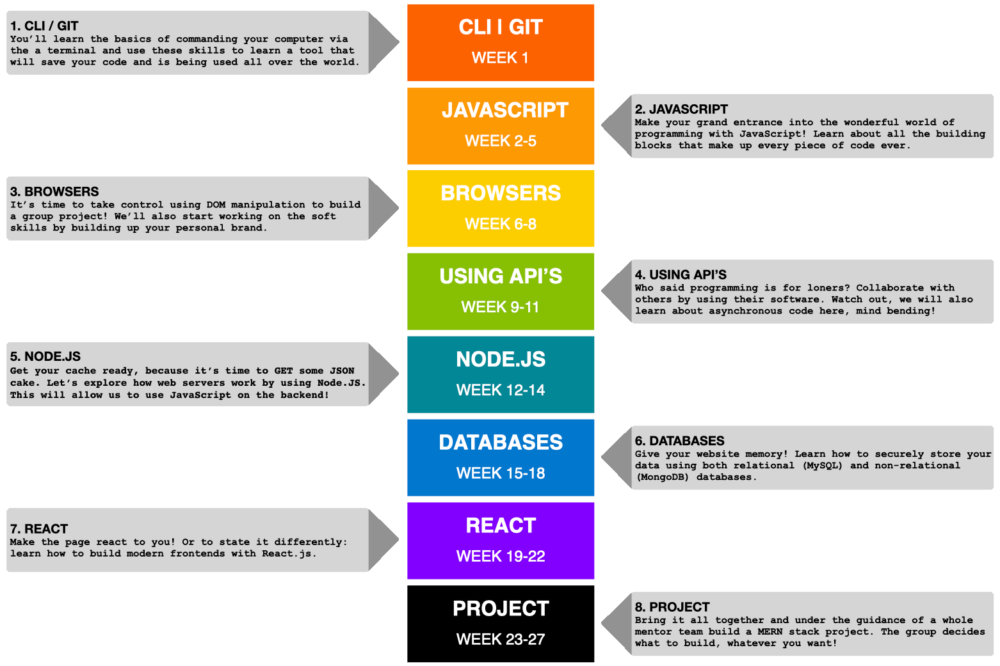

# HackYourFuture Curriculum

> Here you can find an overview of the HackYourFuture program. It gives insight in how our program is structured, organized, what you can expect from the modules that we teach and last but not least where we teach and where you can find support during the week. Our half year course is divided into modules that last 3 weeks with exception of the project module that lasts 6 weeks. Below you can find a short listing of the contents and deliverables/learning goals of the different modules. The headers of the different modules link to the actual repositories that are used by teachers to post assignments/reading materials etc. Be aware that some of the modules make use of more than one repository.

- Are you a new teacher? Take a look [here](https://github.com/HackYourFuture/curriculum/blob/master/i-am-a-new-teacher.md) for some practical tips on how to get started!
- Are you a new student? Take a look at our [Student Manual](https://drive.google.com/file/d/1P-T72skzXP8bDTuIriEOFc5BKr4lPQgr/view) to see how to prepare for your first class!

## Overview

The HackYourFuture curriculum consists of 8 modules, spread over 7 months. Each module has a duration of 3 weeks, with the exception of [React](https://www.github.com/hackyourfuture/react) (5 weeks) and [Project](https://www.github.com/hackyourfuture/project) (7 weeks).

In the following diagram you'll find the sequence of all the modules included:

## Learning goals

If you follow the program you'll learn the following skills:

- Ability to build a basic modern full-stack web application (using NodeJS, MySQL and React)
- Get experience with working in teams using Agile principles
- Knowing how to learn and self-teach new programming concepts
- How to use third-party libraries/APIs
- Have a basic understanding of what it means to work on digital products

## Module #1 - [HTML/CSS/GIT](https://github.com/HackYourFuture/HTML-CSS)

Welcome to the wonderful world of web development! In this module you will learn the basic building blocks of the web: HTML and CSS. HTML gives us the power to add text, images and videos to a page. CSS gives us the power to organize these parts and make it look nice.

The products of HTML and CSS comprise a two-thirds of what is called `frontend` (the final third is client-side JavaScript, which you will learn about in later modules). What is frontend? It's another word for the presentational part of a piece of software. In terms of web development we're talking about "what you see" when you go to any website.

Think of it like this: if a webpage were a person, the HTML would be the skeleton and CSS the skin and clothing!

You'll also be learning [GIT](https//www.github.com/hackyourfuture/git), software that will allow you to save your folders and files in case they accidentally get deleted or end up corrupt. It can do much more and you'll learn all about that starting from week 2!

In the following table you can find the module material, week-by-week:

| Week | Topic                                                  | Reading Materials                                                                         | Homework                                                                              | Lesson Plan                                                                                  |
| ---- | ------------------------------------------------------ | ----------------------------------------------------------------------------------------- | ------------------------------------------------------------------------------------- | -------------------------------------------------------------------------------------------- |
| 0.   | Quick Start!                                           | [W0 Reading](https://github.com/HackYourFuture/HTML-CSS/tree/master/Week0/preparation.md) | -                                                                                     | -                                                                                            |
| 1.   | Command Line Interface basics, HTML/CSS syntax         | [W1 Reading](https://github.com/HackYourFuture/HTML-CSS/tree/master//Week1/README.md)     | [W1 Homework](https://github.com/HackYourFuture/HTML-CSS/tree/master/Week1/MAKEME.md) | [W1 Lesson Plan](https://github.com/HackYourFuture/HTML-CSS/tree/master/Week1/LESSONPLAN.md) |
| 2.   | Introduction to GIT, Responsive design                 | [W2 Reading](https://github.com/HackYourFuture/HTML-CSS/tree/master//Week2/README.md)     | [W2 Homework](https://github.com/HackYourFuture/HTML-CSS/tree/master/Week2/MAKEME.md) | [W2 Lesson Plan](https://github.com/HackYourFuture/HTML-CSS/tree/master/Week2/LESSONPLAN.md) |
| 3.   | GIT branches, CSS frameworks, Working with the browser | [W3 Reading](https://github.com/HackYourFuture/HTML-CSS/tree/master//Week3/README.md)     | [W3 Homework](https://github.com/HackYourFuture/HTML-CSS/tree/master/Week3/MAKEME.md) | [W3 Lesson Plan](https://github.com/HackYourFuture/HTML-CSS/tree/master/Week3/LESSONPLAN.md) |

### **Module goals**

By the end of this module, students should have a familiarity with and basic understanding of the following:

- Be able to write syntactically correct `HTML` and `CSS`
- Understand what is meant by `responsive` web development
- Practice navigating your computer using the `command line interface (CLI)`
- Learn about `GIT` and its basic usage
- Become familiar with `Trello` and `GitHub` as a way to submit your homework
- Know your way around `Visual Studio Code`
- Feel comfortable working with your `browser's inspector`

## Module #2 - [JavaScript1](https://github.com/HackYourFuture/JavaScript1/)

In this module you'll make a start into wonderful world of programming. We will be using the programming language JavaScript to do so. You'll learn about the basic building blocks of programming: `loops`, `functions`, `control flow` and more. Consider these as the ABC's of programming, without them it's impossible to write working software!

| Week | Topic                                                                             | Reading Materials                                                                       | Homework                                                                                 | Lesson Plan                                                                                     |
| ---- | --------------------------------------------------------------------------------- | --------------------------------------------------------------------------------------- | ---------------------------------------------------------------------------------------- | ----------------------------------------------------------------------------------------------- |
| 1.   | What is JavaScript?, Variables, Data Structures & Naming Conventions              | [Reading W1](https://github.com/HackYourFuture/JavaScript1/tree/master/Week1/README.md) | [Homework W1](https://github.com/HackYourFuture/JavaScript1/tree/master/Week1/MAKEME.md) | [Lesson Plan W1](https://github.com/HackYourFuture/JavaScript1/tree/master/Week1/LESSONPLAN.md) |
| 2.   | Statements vs. Expressions, Control flow, Loops, Operators, Conditional statement | [Reading W2](https://github.com/HackYourFuture/JavaScript1/tree/master/Week2/README.md) | [Homework W2](https://github.com/HackYourFuture/JavaScript1/tree/master/Week2/MAKEME.md) | [Lesson Plan W2](https://github.com/HackYourFuture/JavaScript1/tree/master/Week2/LESSONPLAN.md) |
| 3.   | Functions, Thinking like a programmer I, How JavaScript relates to HTML/CSS       | [Reading W3](https://github.com/HackYourFuture/JavaScript1/tree/master/Week3/README.md) | [Homework W3](https://github.com/HackYourFuture/JavaScript1/tree/master/Week3/MAKEME.md) | [Lesson Plan W3](https://github.com/HackYourFuture/JavaScript1/tree/master/Week3/LESSONPLAN.md) |

### **Module goals**

By the end of this module, students should have a familiarity with and basic understanding of the following:

- Have an idea of what `computer programming` is
- Know the basic building blocks of `JavaScript`
- Correctly write and use `variables`, `functions` and `loops`
- Understand the `control flow`
- Think like a programmer

## Module #3 - [JavaScript2](https://github.com/HackYourFuture/JavaScript2)

In **JavaScript2** you'll learn all about how to use JavaScript within the browser. First, you'll learn about how HTML is structured within your browser: we call this the `Document Object Model` (DOM). Once you've gotten the hang of that we'll apply JavaScript to it, in order to manipulate the elements and make our pages more interactive. We call this `DOM manipulation` and it's one of the most interesting things about JavaScript!

| Week | Topic                                                                | Reading Materials                                                                       | Homework                                                                                 | Lesson Plan                                                                                     |
| ---- | -------------------------------------------------------------------- | --------------------------------------------------------------------------------------- | ---------------------------------------------------------------------------------------- | ----------------------------------------------------------------------------------------------- |
| 1.   | Document-Object Model (DOM), DOM manipulation                        | [Reading W1](https://github.com/HackYourFuture/JavaScript2/tree/master/Week1/README.md) | [Homework W1](https://github.com/HackYourFuture/JavaScript2/tree/master/Week1/MAKEME.md) | [Lesson Plan W1](https://github.com/HackYourFuture/JavaScript2/tree/master/Week1/LESSONPLAN.md) |
| 2.   | Synchronous vs. asynchronous, Event Loop, Callbacks, Array Functions | [Reading W2](https://github.com/HackYourFuture/JavaScript2/tree/master/Week2/README.md) | [Homework W2](https://github.com/HackYourFuture/JavaScript2/tree/master/Week2/MAKEME.md) | [Lesson Plan W2](https://github.com/HackYourFuture/JavaScript2/tree/master/Week1/LESSONPLAN.md) |
| 3.   | Scope, Hoisting, Closures, Thinking like a programmer II             | [Reading W3](https://github.com/HackYourFuture/JavaScript2/tree/master/Week3/README.md) | [Homework W3](https://github.com/HackYourFuture/JavaScript2/tree/master/Week3/MAKEME.md) | [Lesson Plan W3](https://github.com/HackYourFuture/JavaScript1/tree/master/Week1/LESSONPLAN.md) |
| 4.   | Test                                                                 | [Details](https://github.com/HackYourFuture/JavaScript2/tree/master/test/README.md)     | -                                                                                        | -                                                                                               |

### **Module goals for JavaScript2**

In order to successfully complete this module you will need to master the following:

- Understand what the `Document Object Model` (DOM) is
- Use the basics of `DOM Manipulation`
- Differentiate between `synchronous` and `asynchronous` operations
- Gain awareness of the inner workings of JavaScript
- Learn to think based on principles, instead of libraries and frameworks

## Module #4 - [JavaScript3](https://github.com/HackYourFuture/JavaScript3)

A big part of being a programmer means moving data from one place to another. It also means working with other people's software. In this module you'll be learning about one of the core things of what makes a web developer: working with APIs!

On top of that you'll also learn how to think differently about how you write your programs. Like in any field, once you've mastered a particular way of doing things you start thinking about how it could be done differently. In programming we call these `paradigms` and in this module you'll learn one such paradigm: Object-Oriented Programming!

| Week | Topic                                                                                       | Reading Materials                                                                       | Homework                                                                                 | Lesson Plan                                                                                     |
| ---- | ------------------------------------------------------------------------------------------- | --------------------------------------------------------------------------------------- | ---------------------------------------------------------------------------------------- | ----------------------------------------------------------------------------------------------- |
| 1.   | Application Programming Interface (API), AJAX, Modules & Libraries                          | [Reading W1](https://github.com/HackYourFuture/JavaScript3/tree/master/Week1/README.md) | [Homework W1](https://github.com/HackYourFuture/JavaScript3/tree/master/Week1/MAKEME.md) | [Lesson Plan W1](https://github.com/HackYourFuture/JavaScript3/tree/master/Week1/LESSONPLAN.md) |
| 2.   | Promises, Fetch API, JavaScript Versions, 'this' keyword, Arrow functions                   | [Reading W2](https://github.com/HackYourFuture/JavaScript3/tree/master/Week2/README.md) | [Homework W2](https://github.com/HackYourFuture/JavaScript3/tree/master/Week2/MAKEME.md) | [Lesson Plan W1](https://github.com/HackYourFuture/JavaScript3/tree/master/Week1/LESSONPLAN.md) |
| 3.   | Object-Oriented Programming (OOP), ES6 Classes, Async/await, Thinking like a programmer III | [Reading W3](https://github.com/HackYourFuture/JavaScript3/tree/master/Week3/README.md) | [Homework W3](https://github.com/HackYourFuture/JavaScript3/tree/master/Week3/MAKEME.md) | [Lesson Plan W1](https://github.com/HackYourFuture/JavaScript3/tree/master/Week1/LESSONPLAN.md) |
| 4.   | Final JavaScript Test                                                                       | [Details](https://github.com/HackYourFuture/JavaScript3/tree/master/test.md)            | -                                                                                        | -                                                                                               |

### **Module goals for JavaScript3**

In order to successfully complete this module you will need to master the following:

- Learn what an `Application Programming Interface` (API) is
- Catch up on the `history of JavaScript`
- Understand how to write more readable `asynchronous` JavaScript
- Connect with different `public APIs`
- Build a `Single Page Application` (SPA)
- Work with pre-existing code
- Learn about `Object-Oriented Programming`

## Module #5 - [Node.js](https://github.com/HackYourFuture/Node.js)

Any software application consists of at least 2 parts: a frontend, which is what the user sees and interacts with, and a backend. This module will expose you to the wonderful world of backend development, where you learn all about where your data goes once you've pressed that submit button. You'll be writing web servers and learn how to send users the right feedback.

| Week | Topic                               | Readings                                                                             | Homework                                                                             | Lesson Plan                                                                                 |
| ---: | ----------------------------------- | ------------------------------------------------------------------------------------ | ------------------------------------------------------------------------------------ | ------------------------------------------------------------------------------------------- |
|   1. | Client-server model, HTTP & Express | [Readings W1](https://github.com/HackYourFuture/Node.js/tree/master/week1/README.md) | [Homework W1](https://github.com/HackYourFuture/Node.js/tree/master/week1/MAKEME.md) | [Lesson Plan W1](https://github.com/HackYourFuture/Node.js/tree/master/week1/LESSONPLAN.md) |
|   2. | REST, CRUD & API                    | [Readings W2](https://github.com/HackYourFuture/Node.js/tree/master/week2/README.md) | [Homework W2](https://github.com/HackYourFuture/Node.js/tree/master/week2/MAKEME.md) | [Lesson Plan W2](https://github.com/HackYourFuture/Node.js/tree/master/week2/LESSONPLAN.md) |
|   3. | Templating engines, API calls       | [Readings W3](https://github.com/HackYourFuture/Node.js/tree/master/week3/README.md) | [Homework W3](https://github.com/HackYourFuture/Node.js/tree/master/week3/MAKEME.md) | [Lesson Plan W3](https://github.com/HackYourFuture/Node.js/tree/master/week3/LESSONPLAN.md) |

### **Module goals for Node.js**

In this module you will get familiar with the world of backend development. By the end of it you have learned:

- What is meant by the term `backend`
- The `client-server` model
- What `HTTP` and `REST` mean
- How to `create your own web servers` with Node.js, using `Express.js`
- What a `templating engine` is.
- How to use the `Node Package Manager (NPM)`.
- How to use Express.js to make a `RESTful API`
- How to build a small `full-stack application`

## Module #6 - [Databases](https://github.com/HackYourFuture/databases)

In this module you'll learn all about a fundamental part of any software application: how to (safely) store data, so that it can be used on-demand. You'll learn how to structure and group data so your apps know where to find and store the correct data.

| Week | Topic                                                                         | Readings                                                                               | Homework                                                                               | Lesson Plan                                                                                   |
| ---: | ----------------------------------------------------------------------------- | -------------------------------------------------------------------------------------- | -------------------------------------------------------------------------------------- | --------------------------------------------------------------------------------------------- |
|   1. | What's a database, Entities, Data structures, Structured Query Language (SQL) | [Readings W1](https://github.com/HackYourFuture/databases/tree/master/Week1/README.md) | [Homework W1](https://github.com/HackYourFuture/databases/tree/master/Week1/MAKEME.md) | [Lesson Plan W1](https://github.com/HackYourFuture/databases/tree/master/Week1/LESSONPLAN.md) |
|   2. | Identifiers, Relationships, Domain Modeling, Advanced SQL commands            | [Readings W2](https://github.com/HackYourFuture/databases/tree/master/Week2/README.md) | [Homework W2](https://github.com/HackYourFuture/databases/tree/master/Week2/MAKEME.md) | [Lesson Plan W2](https://github.com/HackYourFuture/databases/tree/master/Week2/LESSONPLAN.md) |
|   3. | Normalization, Transactions, SQL Injection, NoSQL (with MongoDB)              | [Readings W3](https://github.com/HackYourFuture/databases/tree/master/Week3/README.md) | [Homework W3](https://github.com/HackYourFuture/databases/tree/master/Week3/MAKEME.md) | [Lesson Plan W3](https://github.com/HackYourFuture/databases/tree/master/Week3/LESSONPLAN.md) |

### **Module goals**

In this module you will get familiar with the complexity of storing data. By the end of it you have learned:

- What the meaning is of a `database entity`
- How to work with `Structured Query Language` (SQL)
- Learn all about the `relational model`
- Recognize the `basic setup of a database`
- Know about `MySQL` as an example of a relational database system
- Learn about NoSQL databases, with an emphasis on `MongoDB`

## Module #7 - [React](https://github.com/HackYourFuture/React)

In these 5 weeks we will go back to the frontend and learn how to make faster, more modern user interfaces. You'll become more familiar with a frontend technology called [React.js](https://reactjs.org/), a JavaScript library written and maintained by Facebook.

It is mainly used to create dynamic user interfaces, changing the data a user sees depending on their input.

In this module you'll learn about how to think about webpages in a radically different way: instead of making seperate pages, you'll be making components of pages. Instead of hardcoded content, you'll make structures that can hold different data.

| Week | Topics                                          | Reading Materials                                                                  | Homework                                                                           | Lesson Plans                                                                              |
| ---- | ----------------------------------------------- | ---------------------------------------------------------------------------------- | ---------------------------------------------------------------------------------- | ----------------------------------------------------------------------------------------- |
| 1.   | What is React, JSX, Props, Deploy a static site | [Readings W1](https://github.com/HackYourFuture/React/blob/master/week1/README.md) | [Homework W1](https://github.com/HackYourFuture/React/blob/master/week1/MAKEME.md) | [Lesson Plan W1](https://github.com/HackYourFuture/React/blob/master/week1/LESSONPLAN.md) |
| 2.   | State I, Hooks I, API calls, Forms              | [Readings W2](https://github.com/HackYourFuture/React/blob/master/week2/README.md) | [Homework W2](https://github.com/HackYourFuture/React/blob/master/week2/MAKEME.md) | [Lesson Plan W2](https://github.com/HackYourFuture/React/blob/master/week2/LESSONPLAN.md) |
| 3.   | State II, Hooks II, Third party components      | [Readings W3](https://github.com/HackYourFuture/React/blob/master/week3/README.md) | [Homework W3](https://github.com/HackYourFuture/React/blob/master/week3/MAKEME.md) | [Lesson Plan W3](https://github.com/HackYourFuture/React/blob/master/week3/LESSONPLAN.md) |
| 4.   | Context, Client-side routing                    | [Readings W4](https://github.com/HackYourFuture/React/blob/master/week4/README.md) | [Homework W4](https://github.com/HackYourFuture/React/blob/master/week4/MAKEME.md) | [Lesson Plan W4](https://github.com/HackYourFuture/React/blob/master/week4/LESSONPLAN.md) |
| 5.   | Test                                            | [Details](https://github.com/HackYourFuture/React/blob/master/week5/test.md)       | -                                                                                  | -                                                                                         |

### **Module goals**

By the end of this module, students should have a familiarity with and basic understanding of the following:

- Understand the React way of thinking about `user interfaces`
- Know the importance and place of `state` and how to pass it down
- Be able to work with different `lifecycle hooks`
- Distinguish between `class-based versus function-based components`
- Recognize the utility of `modularization`
- Putting emphasis on writing reusable code (`components`)
- How to handle `client-side routing`

## Module #8 - [Project](https://github.com/HackYourFuture/Project)

In the upcoming 7 weeks you'll be immersed into the web developer life. By the end of it you will have created a full-stack web application and published it to the internet.

Everything you have learned so far will be combined and put into practice. Added to that you'll learn some more cutting-edge technologies that will prepare you for a great start in a modern software company. We will start out with the basics and incrementally add more complexity. This way you'll learn how all the pieces of a RESTful API fit together, thereby gaining a deeper understanding of where the backend stops and frontend starts.

Along with practicing your programming skills you will also be working on your communication skills. This is just as important, because you need to be able to communicate your ideas and efforts in an easy-to-understand manner.

| Week # | Topic                                  |
| ------ | -------------------------------------- |
| 1.     | Introducing Project, Build the backend |
| 2.     | Build the frontend                     |
| 3.     | Bring everything together              |
| 4.     | Presentation, Discuss Features         |
| 5.     | Group: Working on features I           |
| 6.     | Group: Working on features II          |
| 7.     | Final Presentation                     |

### **Module goals**:

By the end of this module, students should have a familiarity with and basic understanding of the following:

Technical skills:

- How to `build a complete full-stack application`
- Understanding `how each part of an application relates` to each other
- What it means to work on a `feature`
- How to work with `GIT in a team setting`
- How to write `readable code`

Communication skills:

- How to `communicate effectively` with team members
- `Keeping track` of your project's progress
- Knowing if you `understand what's asked` of you
- How to `communicate with non-developers` about what you're doing
- Learning how to be `solutions-oriented`
- How to work in a `Agile setting`

## Graduation! What's next?

The final stage is graduation! If you've reached this point you can officially call yourself a **junior web developer**. Be proud of yourself!

At this stage the next step is finding a job. HackYourFuture will assist you, but the responsibility is still on you.

We'll work on finding you an internship/job in any of the companies we have within our network. Your job is to keep your skills sharp, both technically as non-technically.

You can click on any the following addons to keep improving your skills:

## Final words

Learning how to write software is a challenging endeavour. However, with the right material and structure it is very doable.

This curriculum is our effort to make your ambition possible. You are free to use it for your own benefit.

If there's anything inside that you might think could be better, don't hesitate to tell us and/or make pull request!

Good luck with your journey and happy coding!

_The HackYourFuture curriculum is subject to CC BY copyright. This means you can freely use our materials, but just make sure to give us credit for it :)_

 This work is licensed under a <a rel="license" href="http://creativecommons.org/licenses/by/4.0/">Creative Commons Attribution 4.0 International License</a>.
Our curriculum is subject to CC BY copyright. This means you can freely use our materials, but just make sure to give us credit for it:)
