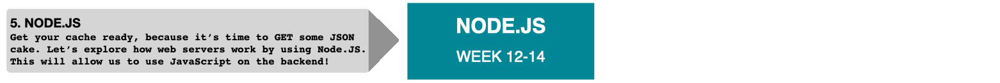

# Currículo HackYourFuture

> Aqui você encontra uma visão geral do programa HackYourFuture. Dá uma visão de como nosso programa está estruturado, organizado, o que você pode esperar dos módulos que ensinamos e, por último, mas não menos importante, onde ensinamos e onde você pode encontrar apoio durante a semana. Abaixo você pode encontrar um resumo dos conteúdos e objetivos de aprendizagem por módulo. Os cabeçalhos dos diferentes módulos são vinculados aos repositórios reais que tanto o aluno quanto o professor usarão para percorrer o material.

- Você é um novo mentor? Dê uma olhada [aqui](https://github.com/HackYourFuture/mentors) para algumas dicas práticas sobre como começar!
- Você é um novo estudante? Certifique-se de começar com nosso [Guia de boas-vindas](https://github.com/HackYourFuture/curriculum/blob/master/welcome.md) para ver como se preparar para sua primeira aula e além!

## Visão geral

O currículo do HackYourFuture consiste em 8 módulos, distribuídos em 7 meses. No diagrama a seguir você encontrará a sequência de todos os módulos incluídos:

## Metas de aprendizagem

Se você seguir o programa, aprenderá as seguintes habilidades:

- Capacidade de 'construir uma aplicação web full-stack moderna básica' (usando NodeJS, MySQL e React)
- Adquira experiência em trabalhar em equipes usando `princípios ágeis`
- Saber `aprender e auto-ensinar novos conceitos de programação`
- Como usar `bibliotecas/APIs de terceiros`
- Ter uma compreensão básica do que significa trabalhar em produtos digitais

## Módulo #1 - [HTML/CSS/GIT](https://github.com/HackYourFuture/HTML-CSS)

Bem-vindo ao maravilhoso mundo do desenvolvimento web! Neste módulo você aprenderá os blocos básicos de construção da web: HTML e CSS. HTML nos dá o poder de adicionar texto, imagens e vídeos a uma página. CSS nos dá o poder de organizar essas partes e torná-las bonitas.

Os produtos de HTML e CSS compreendem dois terços do que é chamado de `frontend` (o terço final é JavaScript do lado do cliente, sobre o qual você aprenderá em módulos posteriores). O que é frontend? É outra palavra para a parte de apresentação de um software. Em termos de desenvolvimento web, estamos falando de "o que você vê" quando acessa qualquer site.

Pense assim: se uma página da web fosse uma pessoa, o HTML seria o esqueleto e o CSS a pele e a roupa!

Você também aprenderá [GIT](https://www.github.com/hackyourfuture/git), software que permitirá que você salve suas pastas e arquivos caso sejam excluídos acidentalmente ou acabem corrompidos. Ele pode fazer muito mais e você aprenderá tudo sobre isso a partir da semana 2!

Na tabela a seguir você encontra o material do módulo, semana a semana:

| Semana | Tópico                                                   | Materiais de Leitura                                                                      | Lição de casa                                                                                 | Plano de aula                                                                                  |
| ---- | -------------------------------------------------- ---- | -------------------------------------------------- --------------------------------------- | -------------------------------------------------- ----------------------------------- | -------------------------------------------------- ------------------------------------------ |
| 0. | Começo rápido! | [W0 Reading](https://github.com/HackYourFuture/HTML-CSS/tree/master/Week0) | - | - |
| 1. | Noções básicas de interface de linha de comando, sintaxe HTML/CSS | [Leitura W1](https://github.com/HackYourFuture/HTML-CSS/tree/master//Week1/README.md) | [W1 Homework](https://github.com/HackYourFuture/HTML-CSS/tree/master/Week1/MAKEME.md) | [Plano de aula W1](https://github.com/HackYourFuture/HTML-CSS/tree/master/Week1/LESSONPLAN.md) |
| 2. | Introdução ao GIT, design responsivo | [Leitura W2](https://github.com/HackYourFuture/HTML-CSS/tree/master//Week2/README.md) | [W2 Homework](https://github.com/HackYourFuture/HTML-CSS/tree/master/Week2/MAKEME.md) | [Plano de aula W2](https://github.com/HackYourFuture/HTML-CSS/tree/master/Week2/LESSONPLAN.md) |
| 3. | Ramificações GIT, frameworks CSS, Trabalhando com o navegador | [Leitura W3](https://github.com/HackYourFuture/HTML-CSS/tree/master//Week3/README.md) | [W3 Homework](https://github.com/HackYourFuture/HTML-CSS/tree/master/Week3/MAKEME.md) | [Plano de aula W3](https://github.com/HackYourFuture/HTML-CSS/tree/master/Week3/LESSONPLAN.md) |

### **Metas do módulo**

Ao final deste módulo, os alunos devem ter uma familiaridade e compreensão básica do seguinte:

- Ser capaz de escrever `HTML` e `CSS` sintaticamente corretos
- Entenda o que se entende por desenvolvimento web `responsivo`
- Pratique a navegação em seu computador usando a `interface de linha de comando (CLI)`
- Aprenda sobre `GIT` e seu uso básico
- Familiarize-se com `Trello` e `GitHub` como forma de enviar sua lição de casa
- Conheça o seu caminho em torno do `Visual Studio Code`
- Sinta-se confortável trabalhando com o seu `inspetor do navegador`

## Módulo #2 - [JavaScript](https://github.com/HackYourFuture/JavaScript/)

Neste módulo você começará no maravilhoso mundo da programação. Nós estaremos usando a linguagem de programação JavaScript para fazer isso. Você aprenderá sobre os blocos básicos de programação: `loops`, `funções`, `fluxo de controle` e muito mais. Considere estes como o ABC da programação, sem eles é impossível escrever software funcional!

| Semana | Tópico | Materiais de Leitura | Lição de casa |
| ---- | -------------------------------------------------- -------- | -------------------------------------------------- -------------------------- | -------------------------------------------------- --------------------------------------- |
| 1. | Variáveis, Tipos de Variáveis, Operadores, Objetos, Matrizes | [Lendo W1](https://github.com/HackYourFuture/JavaScript/tree/master/Week1/README.md) | [Homework W1](https://github.com/HackYourFuture/JavaScript/tree/master/Week1/MAKEME.md) |
| 2. | Loops, Fluxo de Controle, If/Else, Convenções de Nomenclatura, Treinamento de Carreira I | [Lendo W2](https://github.com/HackYourFuture/JavaScript/tree/master/Week2/README.md) | [Homework W2](https://github.com/HackYourFuture/JavaScript/tree/master/Week2/MAKEME.md) |
| 3. | Funções, Escopo, ModernJS. | [Lendo W3](https://github.com/HackYourFuture/JavaScript/tree/master/Week3/README.md) | [Homework W3](https://github.com/HackYourFuture/JavaScript/tree/master/Week3/MAKEME.md) |
| 4. | Funções de ordem superior, funções de matriz, fechamentos | [Lendo W4](https://github.com/HackYourFuture/JavaScript/tree/master/Week4/README.md) | [Homework W4](https://github.com/HackYourFuture/JavaScript/tree/master/Week4/MAKEME.md) |

### **Metas do módulo**

Ao final deste módulo, os alunos devem ter uma familiaridade e compreensão básica do seguinte:

- Ter uma ideia do que é `programação de computadores`
- Conheça os blocos básicos de construção do `JavaScript`
- Escreva e use corretamente `variables`, `functions` e `loops`
- Compreender o `fluxo de controle`
- Pense como um programador
- Saiba o que é sua 'marca pessoal' e como torná-la profissional

## Módulo #3 - [Navegadores](https://github.com/HackYourFuture/Browsers)

Em **Navegadores**, você aprenderá tudo sobre como usar JavaScript no navegador. Primeiro, você aprenderá como o HTML é estruturado em seu navegador: chamamos isso de `Document Object Model` (DOM). Depois que você pegar o jeito, vamos aplicar JavaScript nele, para manipular os elementos e tornar nossas páginas mais interativas. Chamamos isso de `manipulação DOM` e é uma das coisas mais interessantes sobre JavaScript! Terminaremos com um projeto em grupo para já combinar tudo o que você aprendeu em sua primeira aplicação web. Além da parte técnica, você também aprimorará suas 'soft skills' no [módulo de apresentação](https://github.com/HackYourFuture/presentation-module). Este é um programa de duas semanas que vai tirar você da sua zona de conforto. Verifique o arquivo Read.me para obter uma explicação e visão geral mais detalhadas.

| Semana | Tópico | Materiais de Leitura | Lição de casa |
| ---- | ----- | ----------------- | -------- |
| 1. | Modelo de Documento-Objeto (DOM), manipulação de DOM | [Lendo W1](https://github.com/HackYourFuture/Browsers/tree/master/Week1/README.md) | [Homework W1](https://github.com/HackYourFuture/Browsers/tree/master/Week1/MAKEME.md) |
| 2. | Módulo de apresentação semana 1, semana de projeto em grupo 1! | [Lendo W2](https://github.com/HackYourFuture/Browsers/tree/master/Week2/README.md) | [Homework W2](https://github.com/HackYourFuture/Browsers/tree/master/Week2/MAKEME.md) |
| 3. | Módulo de apresentação semana 2, projeto de grupo semana 2 + entrevista técnica | [Lendo W3](https://github.com/HackYourFuture/Browsers/tree/master/Week3/README.md) | Nenhum dever de casa individual |

### **Metas do módulo**

Para concluir com sucesso este módulo, você precisará dominar o seguinte:

- Entenda o que é o `Document Object Model` (DOM)
- Use o básico de `Manipulação DOM`
- Ganhar consciência do funcionamento interno do JavaScript
- Ser capaz de apresentar suas ideias em um ambiente profissional

## Módulo #4 - [Usando APIs](https://github.com/HackYourFuture/UsingAPIs)

Uma grande parte de ser um programador significa mover dados de um lugar para outro. Também significa trabalhar com software de outras pessoas. Neste módulo, você aprenderá sobre uma das coisas principais do que faz um desenvolvedor web: trabalhar com APIs! Além disso, você também aprenderá a pensar de maneira diferente sobre como escrever seus programas. Como em qualquer campo, uma vez que você domina uma determinada maneira de fazer as coisas, você começa a pensar em como isso poderia ser feito de forma diferente. No final, você também construirá um projeto completo por conta própria que leva dados de APIs publicamente disponíveis para criar uma aplicação web com substância!

| Semana | Tópico | Materiais de Leitura | Lição de casa |
| ---- | ----- | ----------------- | -------- |
| 1. | Síncrono vs assíncrono, Callbacks, Promises, The Event Loop | [Lendo W1](https://github.com/HackYourFuture/UsingAPIs/tree/master/Week1/README.md) | [Homework W1](https://github.com/HackYourFuture/UsingAPIs/tree/master/Week1/MAKEME.md) |
| 2. | Interface de programação de aplicativos (API), buscar, assíncrono/aguardar, treinamento de carreira II | [Lendo W2](https://github.com/HackYourFuture/UsingAPIs/tree/master/Week2/README.md) | [Homework W2](https://github.com/HackYourFuture/UsingAPIs/tree/master/Week2/MAKEME.md) |
| 3. | Projeto individual + entrevista técnica | [Projeto](https://github.com/HackYourFuture/UsingAPIs/tree/master/Week3/README.md) | |

### **Metas do módulo**

Para concluir com sucesso este módulo, você precisará dominar o seguinte:

- Diferenciar entre operações `síncronas` e `assíncronas`
- Saiba o que é uma `Application Programming Interface` (API)
- Conecte-se com diferentes `APIs públicas`
- Crie um 'Aplicativo de página única' (SPA)
- Trabalhar com código pré-existente
- Ser capaz de pregar uma entrevista

## Módulo #5 - [Node.js](https://github.com/HackYourFuture/Node.js)

Qualquer aplicativo de software consiste em pelo menos 2 partes: um frontend, que é o que o usuário vê e com o qual interage, e um backend. Este módulo irá expô-lo ao maravilhoso mundo do desenvolvimento de back-end, onde você aprenderá tudo sobre para onde seus dados vão depois de pressionar o botão de envio. Você estará escrevendo servidores web e aprenderá como enviar aos usuários o feedback correto.

| Semana | Tópico | Leituras | Lição de casa | Plano de aula |
| ---: | ----------------------------------- | -------------------------------------------------- ---------------------------------- | -------------------------------------------------- ---------------------------------- | -------------------------------------------------- ----------------------------------------- |
| 1. | Modelo cliente-servidor, HTTP & Express | [Leituras W1](https://github.com/HackYourFuture/Node.js/tree/master/week1/README.md) | [Homework W1](https://github.com/HackYourFuture/Node.js/tree/master/week1/MAKEME.md) | [Plano de aula W1](https://github.com/HackYourFuture/Node.js/tree/master/week1/LESSONPLAN.md) |
| 2. | REST, CRUD e API | [Leituras W2](https://github.com/HackYourFuture/Node.js/tree/master/week2/README.md) | [Homework W2](https://github.com/HackYourFuture/Node.js/tree/master/week2/MAKEME.md) | [Plano de aula W2](https://github.com/HackYourFuture/Node.js/tree/master/week2/LESSONPLAN.md) |

### **Metas do módulo**

Neste módulo, você se familiarizará com o mundo do desenvolvimento de back-end. Ao final, você aprendeu:

- O que significa o termo `backend`
- O modelo `cliente-servidor`
- O que significa `HTTP` e `REST`
- Como `criar seus próprios servidores web` com Node.js, usando `Express.js`
- O que é um 'motor de modelagem'.
- Como usar o `Node Package Manager (NPM)`.
- Como usar o Express.js para fazer uma `API RESTful`
- Como construir um pequeno `aplicativo full-stack`

## Módulo #6 - [Bancos de dados](https://github.com/HackYourFuture/databases)

Neste módulo, você aprenderá tudo sobre uma parte fundamental de qualquer aplicativo de software: como armazenar dados (com segurança), para que possam ser usados sob demanda. Você aprenderá a estruturar e agrupar dados para que seus aplicativos saibam onde encontrar e armazenar os dados corretos.

| Semana | Tópico | Leituras | Lição de casa |
| ---: | -------------------------------------------------- --------------------------- | -------------------------------------------------- ------------------------------------ | -------------------------------------------------- ------------------------------------ |
| 1. | O que é um banco de dados, Entidades, Estruturas de dados, Linguagem de consulta estruturada (SQL) | [Leituras W1](https://github.com/HackYourFuture/databases/tree/master/Week1/README.md) | [Homework W1](https://github.com/HackYourFuture/databases/tree/master/Week1/MAKEME.md) |
| 2. | Identificadores, Relacionamentos, Modelagem de Domínio, Comandos SQL Avançados | [Leituras W2](https://github.com/HackYourFuture/databases/tree/master/Week2/README.md) | [Homework W2](https://github.com/HackYourFuture/databases/tree/master/Week2/MAKEME.md) |
| 3. | Normalização, Transações, SQL Injection, NoSQL (com MongoDB) | [Leituras W3](https://github.com/HackYourFuture/databases/tree/master/Week3/README.md) | [Homework W3](https://github.com/HackYourFuture/databases/tree/master/Week3/MAKEME.md) |
| 4. | Comandos avançados NoSQL, Paginação, SQL vs NoSQL | [Leituras W4](https://github.com/HackYourFuture/databases/tree/master/Week4/README.md) | [Homework W4](https://github.com/HackYourFuture/databases/tree/master/Week4/MAKEME.md) | |
### **Metas do módulo**

Neste módulo, você se familiarizará com a complexidade do armazenamento de dados. Ao final, você aprendeu:

- Qual é o significado de uma `entidade de banco de dados`
- Como trabalhar com `Linguagem de Consulta Estruturada` (SQL)
- Aprenda tudo sobre o `modelo relacional`
- Reconhecer a `configuração básica de um banco de dados`
- Conhecer o `MySQL` como exemplo de um sistema de banco de dados relacional
- Aprenda sobre bancos de dados NoSQL, com ênfase em `MongoDB`

## Módulo #7 - [React](https://github.com/HackYourFuture/React)

Nestas 4 semanas voltaremos ao frontend e aprenderemos a fazer interfaces de usuário mais rápidas e modernas. Você ficará mais familiarizado com uma tecnologia de front-end chamada [React.js](https://reactjs.org/), uma biblioteca JavaScript escrita e mantida pelo Facebook.

É usado principalmente para criar interfaces de usuário dinâmicas, alterando os dados que um usuário vê dependendo de sua entrada.

Neste módulo, você aprenderá a pensar em páginas da Web de uma maneira radicalmente diferente: em vez de criar páginas separadas, você criará componentes de páginas. Em vez de conteúdo codificado, você criará estruturas que podem conter dados diferentes.
                                                               | - |
| Semana | Tópicos | Materiais de Leitura | Lição de casa |
| ---- | ----------------------------------------------- | -------------------------------- | -------------------------------- |
| 1. | O que é React, JSX, State & Props, Implante um site estático | [Leituras W1](https://github.com/HackYourFuture/React/blob/master/week1/README.md) | [Homework W1](https://github.com/HackYourFuture/React/blob/master/week1/MAKEME.md) |
| 2. | Chamadas de API, Contexto | [Leituras W2](https://github.com/HackYourFuture/React/blob/master/week2/README.md) | [Homework W2](https://github.com/HackYourFuture/React/blob/master/week2/MAKEME.md) |
| 3. | Roteamento do lado do cliente, ganchos personalizados | [Leituras W3](https://github.com/HackYourFuture/React/blob/master/week3/README.md) | [Homework W3](https://github.com/HackYourFuture/React/blob/master/week3/MAKEME.md) |
| 4. | Projeto! | [Leituras W4](https://github.com/HackYourFuture/React/blob/master/week4/README.md) | |

### **Metas do módulo**

Ao final deste módulo, os alunos devem ter uma familiaridade e compreensão básica do seguinte:

- Compreender o modo React de pensar sobre `interfaces de usuário`
- Conheça a importância e o lugar do 'estado' e como transmiti-lo
- Ser capaz de trabalhar com diferentes `ganchos de ciclo de vida`
- Distinguir entre `componentes baseados em classes versus componentes baseados em funções`
- Reconhecer a utilidade da `modularização`
- Colocando ênfase na escrita de código reutilizável (`components`)
- Como lidar com o `roteamento do lado do cliente`

## Módulo #8 - [Projeto](https://github.com/HackYourFuture/Project)

Nas próximas 7 semanas, você estará imerso na vida do desenvolvedor web. Ao final, você terá criado um aplicativo da Web full-stack e publicado na Internet.

Tudo o que você aprendeu até agora será combinado e colocado em prática. Além disso, você aprenderá mais algumas tecnologias de ponta que o prepararão para um grande começo em uma empresa de software moderna. Começaremos com o básico e adicionaremos gradualmente mais complexidade. Dessa forma, você aprenderá como todas as partes de uma API RESTful se encaixam, obtendo assim uma compreensão mais profunda de onde o back-end termina e o front-end começa.

Além de praticar suas habilidades de programação, você também estará trabalhando em suas habilidades de comunicação. Isso é tão importante quanto, porque você precisa ser capaz de comunicar suas ideias e esforços de uma maneira fácil de entender.

| Semana # | Tópico |
| ------ | --------------------------------------- |
| 1. | Apresentando o Project, Crie wireframes |
| 2. | Construir recursos I |
| 3. | Construir recursos II, Finalizar MVP |
| 4. | Construir recursos III, apresentar o SCRUM |
| 5. | Construir recursos IV, Retrospectiva |
| 6. | Finalizar candidatura |
| 7. | Apresentação Final |

### **Metas do módulo**

Ao final deste módulo, os alunos devem ter uma familiaridade e compreensão básica do seguinte:

Habilidades técnicas:

- Como `construir um aplicativo full-stack completo`
- Compreender `como cada parte de um aplicativo se relaciona` entre si
- O que significa trabalhar em um `recurso`
- Como trabalhar com `GIT em um ambiente de equipe`
- Como escrever `código legível`

Habilidades de comunicação:

- Como 'comunicar-se efetivamente' com os membros da equipe
- `Manter o controle` do progresso do seu projeto
- Saber se você 'entende o que é pedido' de você
- Como 'comunicar com não desenvolvedores' sobre o que você está fazendo
- Aprender a ser `orientado para soluções`
- Como trabalhar em uma `configuração ágil`

## Graduação! Qual é o próximo?

A fase final é a formatura! Se você chegou a esse ponto, pode se chamar oficialmente de **desenvolvedor web júnior**. Tenha orgulho de si mesmo!

Nesta fase, o próximo passo é encontrar um emprego. HackYourFuture irá ajudá-lo, mas a responsabilidade ainda é sua.

Trabalharemos para encontrar um estágio/emprego para você em qualquer uma das empresas que temos em nossa rede. Seu trabalho é manter suas habilidades afiadas, tanto tecnicamente quanto não tecnicamente. Além disso, certifique-se de verificar os seguintes repositórios:

- [Sua marca pessoal](https://github.com/HackYourFuture/yourpersonalbrand)  
- [Preparação da entrevista](https://github.com/HackYourFuture/interviewpreparation)

Você pode clicar em qualquer um dos seguintes complementos para continuar melhorando suas habilidades:

Por último, mas não menos importante, se você deseja melhorar suas habilidades de inglês e apresentação, entre em contato com a equipe e tomaremos as providências adequadas. O mesmo se você quiser participar de um grupo [Fellowship](https://www.hackyourfuture.net/fellowship/)!

## Palavras finais

Aprender a escrever software é um esforço desafiador. No entanto, com o material e a estrutura certos, é muito viável.

Este currículo é o nosso esforço para tornar a sua ambição possível. Você é livre para usá-lo para seu próprio benefício.

Se houver algo dentro que você acha que poderia ser melhor, não hesite em nos dizer e/ou fazer um pull request!

Boa sorte com sua jornada e boa codificação!

_O currículo HackYourFuture está sujeito aos direitos autorais CC BY. Isso significa que você pode usar nossos materiais livremente, mas certifique-se de nos dar crédito por isso :)_

 Esta obra está licenciada sob uma <a rel="license" href="http://creativecommons.org /licenses/by/4.0/">Licença Creative Commons Atribuição 4.0 Internacional</a>.
Nosso currículo está sujeito a direitos autorais CC BY. Isso significa que você pode usar nossos materiais livremente, mas certifique-se de nos dar crédito por isso :)
